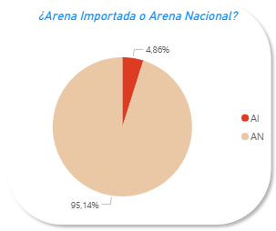

# Análisis de Fracturas realizadas en Formaciones No Convencionales de Argentina período 2014 – 2025.

##  Objetivo

Este dashboard tiene como finalidad comparar las fracturas realizadas en formaciones geológicas de tipo shale frente a aquellas realizadas en formaciones tight, utilizando información agrupada por tipo de arena, empresa, formación geológica, tipo de terminación, longitudes horizontales de los pozos y evolución temporal de las etapas. El análisis busca identificar patrones relevantes en la actividad de fracturas hidráulicas en Argentina. Por otro lado, se realizó un análisis más profundo enfocado en la Formación Vaca Muerta, utilizando información de presiones, potencias de los equipos y eficiencia de las etapas de fracturas. El objetivo de esto último es, dada la relevancia de la Formación Vaca Muerta, analizar las tendencias y evolución de la actividad en dicha Formación.

---

##  Secciones del Dashboard

Se dividió en dos secciones: por un lado, el análisis general del No Convencional Argentino (Shale vs Tight) y una segunda sección enfocada a Vaca Muerta.

## Primera sección:
### 1. ¿Arena Nacional o Importada?
| Formación Shale | Formación Tight |
|------------------|------------------|
| ||
- Predominancia del uso de **arena nacional (95.14%)** frente a al uso de **arena importada (4.86%)** en formaciones shale. Mientras que en formaciones tight, sucede lo mismo, pero con una distribución un poco más repartida: uso de **arena importada (31.71%)** respecto al uso de **arena nacional (68.29%)**. 

### 2. Etapas por Formación
| Formación Shale | Formación Tight |
|------------------|------------------|
| ||
- Se destaca **Vaca Muerta** como la formación con mayor actividad (68.813 etapas) en shale, mientras que en tight, se destaca la formación **Mulichinco** (302 etapas).

### 3. Etapas por Empresa
 Formación Shale | Formación Tight |
|------------------|------------------|
|||
- **YPF** lidera la actividad en shale con 38.751 etapas realizadas y **TotalEnergies** con 229 etapas realizadas en tight.
- La compañía privada con mayor participación en shale es **Vista Energy** con 7.077 etapas. 

### 4. Tipos de Terminación
 Formación Shale | Formación Tight |
|------------------|------------------|
|||
- El método más común es **tapón-disparo** (59.850 etapas) en shale y **Jetteo** (229 etapas) en tight.

### 5. Evolución Etapas y Longitudes Horizontales por Año
 Formación Shale | Formación Tight |
|------------------|------------------|
|||
- Se observa que la actividad en formaciones del tipo shale, muestran una tendencia creciente con el pasar de los años. Lo mismo sucede con las longitudes horizontales de los pozos. Caso contrario en formaciones del tipo tight que se observan muchas fluctuaciones en la actividad, mostrando la baja actividad en ese tipo de formaciones (últimos registros en el año **2022**).
- Principalmente en las formaciones del tipo sale (destacando **Vaca Muerta**), se observa una clara disminución en la actividad en el año **2020** debido a la pandemia del **COVID-19**.

## Segunda sección:
### 1. Comparación entre Tiempo de Realización y Etapas de Fracturas por Año

- Hasta el año **2019**, se observa una relación creciente entre el tiempo de duración y la cantidad de etapas. En el año **2020**, hubo una baja actividad (menos etapas realizadas en mayores tiempos de realización) debido a la pandemia. A su vez, este año fue el punto de inflexión ya que a partir del **2021** se observa una tendencia creciente en las cantidades de etapas realizadas en menos tiempo.

### 2. Presiones y Potencias de Equipos por Año

- Estas dos variables son proporcionales. Hasta el año **2016**, se muestra una relación "lineal" entre ambas variables. Luego, desde el año **2016** hasta el año **2019** se observa una baja actividad, pero logrando aumentar las presiones en superficie. A partir de ese año, obviando el año **2020** donde hubo una baja actividad en la industria debido a la pandemia (menos actividad, menos equipos utilizados), hubo una tendencia creciente en cuanto a la potencia usada, manteniendo las presiones relativamente constantes.

### 3. Eficiencia y Longitudes Horizontales por Año

- La eficiencia se midió dividiendo la cantidad de etapa por el tiempo de realización de estas. En **2018** se observa claramente el punto de partida en cuanto a la evolución de la eficiencia, aún estando en pandemia **(2020)**, se observa un aumento de la eficiencia a pesar de la baja actividad sobre la formación Vaca Muerta. Si lo comparamos con la evolución de las longitudes horizontales de los pozos en dicha formación, podemos observar con detalle esa evolución de eficiencia con el pasar de los años, realizando más etapas en longitudes mayores, en menos tiempo.

---

##  Insights Destacados

1. **Shale vs Tight: Concentración de Actividad**
   - Las formaciones shale (especialmente **Vaca Muerta**) muestran una concentración desproporcionada de actividad en comparación con las formaciones tight.
   - Esto podría evidenciar diferencias en rentabilidad o tecnología aplicada.

2. **Dominancia Nacional en Provisión de Arena**
   - El 95.09% de la arena utilizada es nacional (incluyendo ambos tipos de formaciones), lo cual representa una fortaleza en términos logísticos y de costos frente a la importación.

3. **Empresas con Mayor Participación**
   - YPF actúa como motor principal de la actividad (principalmente en **Vaca Muerta**), reflejando mayores inversiones en formaciones del tipo shale.
   

4. **Preferencias Tecnológicas**
   - La prevalencia del método tapón-disparo puede asociarse a su efectividad y estandarización en formaciones shale, aunque también se aplica en tight.

5. **Tiempos de realización y Etapas**
   - Claramente el desarrollo de nuevas tecnologías afecta positivamente al desarrollo de la actividad, realizando más etapas y reduciendo los tiempos de realización, aún perforando pozos con mayor longitud en la rama horizontal.
6. **Presiones y Potencias de Equipos** 
    - Con el pasar de los años, en la formación Vaca Muerta, se fueron desarrollando fracturas más complejas y perforando longitudes mayores en la rama horizontal, lo que permitió desarrollar más etapas de fracturas por pozo. Algo curioso a destacar, que podría ser otro tema de estudio, es la tendencia creciente por parte de las potencias usadas por los equipos (más potencia, más consumo de energía) y ver si con el pasar de los años, ese consumo tiende a bajar (eficiencia energética), logrando un desarrollo sostenible en la Formación Vaca Muerta.
7. **Eficiencia de Etapas y Longitudes**
   - Se pudo visualizar que con el avance de la tecnología se logró realizar más etapas de fracturas con el aumento de las longitudes en la rama horizontal. Este insight, está fuertemente relacionado con el insight anterior, lo que también sería interesante ver si el comportamiento de ambas variables sigue siendo creciente si se baja el consumo energético.

---

##  Sobre el Dataset

Este análisis fue realizado a partir de datos públicos disponibles sobre etapas de fractura hidráulica brindado por la Secretaria de Energía de la Nación,  categorizados por formación geológica, empresa operadora, tipo de terminación y año de realización. El tratamiento de datos incluyó procesos de ETL (extract, transform and load) y visualización en Power BI.

---

##  Autor

**Ignacio Ponce**
Ingeniero en Petróleo - Comenzando en el mundo de los datos.
